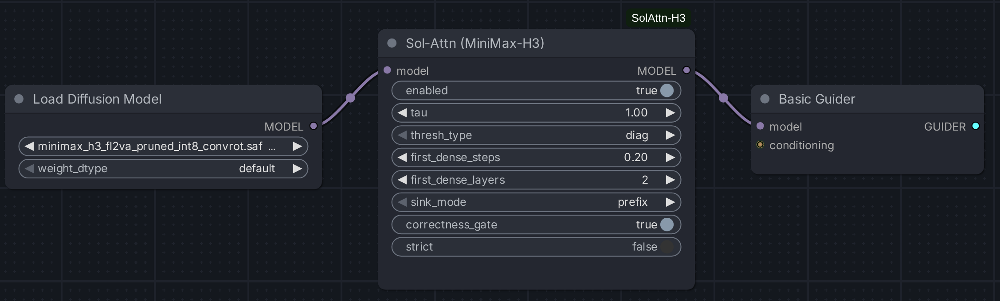
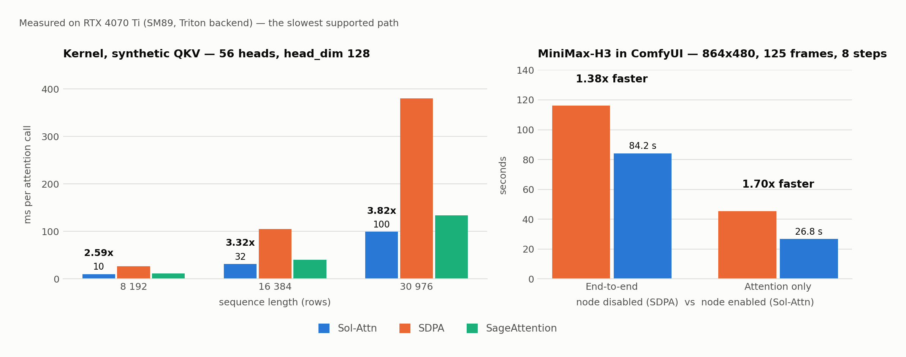

# ComfyUI-SolAttn-H3

**Sol-Attn** — NVIDIA's training-free sparse attention from
[Sol Engine](https://github.com/NVlabs/Sana/tree/sol-engine) — wired into
ComfyUI's native **MiniMax-H3**.

One node. No training, no LoRA, no offline calibration. When the kernel contract
isn't met, the node falls back to dense attention **with a named reason** — never
silently.



---

## Results

<picture>
  <source media="(prefers-color-scheme: dark)" srcset="docs/images/benchmark-dark.png">
  
</picture>

All numbers below were measured on an **RTX 4070 Ti (SM89, Triton backend)** —
the *slowest* supported path. SM90/SM100/SM120 get CuTe DSL kernels, which this
machine cannot exercise. Do not transfer these numbers to other GPUs; run
`selftest.py` on yours instead.

### End-to-end, MiniMax-H3 in ComfyUI

864×480, 125 frames (**17 504**-row packed sequence), 8 steps, `res_multistep`,
int8 `fl2va` weights. Baseline is ComfyUI's own default attention in this
install — `pytorch attention` (SDPA). Measurement pass after warm-up:

| Metric | Node off | Node on | Ratio |
|---|---:|---:|---:|
| **End-to-end wall clock** | 116.1 s | **84.2 s** | **1.38×** |
| Attention, total | 45.5 s | 26.8 s | 1.70× |
| Attention, per dense call | 113.65 ms | 113.32 ms | — |
| Attention, per sparse call | — | **47.87 ms** | **2.37×** |
| Sparse / dense calls | 0 / 400 | 288 / 112 | — |
| Routing density (effective) | — | 0.258 | — |

Dense-call latency across four independent runs: 113.18 / 113.27 / 113.65 /
113.32 ms. That the `off` and `on` runs agree on the *same* code path is the
control for the measurement itself — the instrumentation does not skew results.

Attention accounts for **59 %** of step time here (45.5 s of 76 s sampling), so
kernel speedup translates to wall clock in a sane proportion.

### Kernel only, synthetic QKV (`selftest.py`)

56 heads, head_dim 128, `tau=1.0`, `thresh_type=diag`:

| Sequence | Gate | Density | Sol-Attn | SDPA | SageAttention | vs SDPA | vs Sage |
|---:|:--:|---:|---:|---:|---:|---:|---:|
| 5 548 | PASS | 0.231 | — | — | — | 2.75× | 1.27× |
| 8 192 | PASS | 0.271 | 10.2 ms | 26.4 ms | 11.2 ms | 2.58× | 1.09× |
| 16 384 | PASS | 0.214 | 31.7 ms | 105.4 ms | 40.0 ms | 3.32× | 1.26× |
| 30 976 | PASS | 0.186 | 99.6 ms | 380.0 ms | 133.6 ms | **3.82×** | **1.34×** |

Routing density falls as the sequence grows — **the longer the video, the more
Sol-Attn pays off.**

### One-off costs

First sparse call in a process: **13.4 s** (Triton kernel compilation) plus the
correctness gate and density probe. With a warm cache it drops to **0.38 s**.

**Triton compiles per sequence shape, not once per process.** Every new
resolution or frame count pays that cost again, and on short runs it can eat the
entire gain. Second measurement point — 640×384, 73 frames (**5 548** rows),
20 steps:

| Metric | Node off | Node on | Ratio |
|---|---:|---:|---:|
| Attention, per call | 11.88 ms | **7.33 ms** | 1.62× |
| Attention, excluding one-off | 11.9 s | 8.4 s | 1.41× |
| Compilation for the new shape | — | 3.4 s | — |
| **End-to-end wall clock** | 40.3 s | 39.1 s | **1.03×** |

Shorter sequence → smaller per-call win *and* a smaller attention share of the
step *and* the same fixed compile spread over less work.

### Composing with `ComfyUI-MiniMaxH3-Cache`

Sol-Engine's H3 line composes Sol-Attn with FirstBlockCache, so this is intended.
Verified with `strict=True`, 20 steps, 5 548-row sequence:

```
sparse_calls: 336   dense_calls: 114   last_step: 19   total_steps: 20
```

450 attention calls instead of 1 000 — the cache skipped 11 of 20 forwards — yet
the step number and schedule length stayed correct, `strict` raised nothing, and
the sparse path still ran 336 times. Wall clock: 39.1 s → **20.0 s**.

This is precisely why the step index is read from `sample_sigmas` rather than
counted: **a forward counter would drift on every skipped step.**

---

## Quality — and why off-vs-on PSNR misleads

Sol-Attn is an **approximation**, not a lossless path. Same seed, 20 steps,
5 548-row sequence: decoded frames compare at **22.4 dB** PSNR.

That number alone is misleading, as the control run shows. At `tau = -1000` the
router admits **every** block (measured density: exactly 1.0), so the kernel
computes full attention and skips nothing. PSNR against the dense path is still
only **30.7 dB**:

| Configuration | Routing density | PSNR vs dense |
|---|---:|---:|
| `tau = -1000` (nothing skipped) | 1.000 | 30.7 dB |
| `tau = 1.0` (production policy) | 0.311 | 22.4 dB |

In other words the **floor is ~31 dB**, and it comes from swapping the attention
implementation at all. Per-call relative error is 0.1 % (`rel_l2` from the gate)
and the worst element is exactly half a bf16 ulp — as good as the format allows.
Applied ~960 times (20 steps × 48 sparse layers) inside a non-linear sampler,
trajectory divergence becomes macroscopic. Routing adds roughly 8 dB on top.

This is not an integration defect: the correctness gate passes, prefix rows match
dense attention, and the decline path returns the original backend's output
bit-for-bit — all covered by GPU tests. NVIDIA's own reference warns about it —
*"a visual metric alone will rate it too highly on this model"* — and reports
LPIPS 0.293 for H3.

**Practical takeaway:** judge it on your own material, not on PSNR. For work that
must match the native trajectory, flip `enabled` off and compare the same prompt
at the same seed.

---

## Requirements

| | |
|---|---|
| ComfyUI | with native MiniMax-H3 (`comfy.ldm.minimax`) |
| GPU | NVIDIA, compute capability ≥ 8.0 |
| PyTorch | ≥ 2.10 |
| CUDA | ≥ 12.8 |
| Triton | ≥ 3.6 |
| CuTe DSL | optional: `cutlass-python` ≥ 4.5 + `cuda-python` |

Backend is selected automatically from the GPU architecture:

| Architecture | Example | Backend |
|---|---|---|
| SM90 | H100 | CuTe DSL |
| SM100 | B200 / GB200 | CuTe DSL |
| SM120 | RTX 5090, RTX PRO 6000 Blackwell | CuTe DSL |
| SM80 / SM86 / SM89 | A100, RTX 3090, RTX 4090 | Triton |

Missing `cutlass.cute` or `cuda-python` falls back to Triton regardless of
architecture. The node prints the selected backend when it mounts.

## Installation

```bash
git clone https://github.com/quzopl/ComfyUI-SolAttn-H3 \
  ComfyUI/custom_nodes/ComfyUI-SolAttn-H3

# The kernel is installed from NVlabs, not vendored here
git clone --branch sol-engine --depth 1 https://github.com/NVlabs/Sana.git ~/sana-sol-engine
uv pip install --python ComfyUI/venv/bin/python \
  -e ~/sana-sol-engine/techniques/sparse_backends
```

Check your environment without launching ComfyUI:

```bash
ComfyUI/venv/bin/python ComfyUI/custom_nodes/ComfyUI-SolAttn-H3/selftest.py
```

It prints the GPU, selected backend, correctness-gate verdict, routing density,
and a speed comparison against SDPA and SageAttention at the sequence lengths you
pass in. If the gate fails on your card you find out in a minute instead of after
a week of odd artifacts.

## Parameters

| Parameter | Default | Meaning |
|---|---|---|
| `enabled` | on | Turns everything off without rewiring the graph. |
| `tau` | 1.0 | Higher = fewer K/V blocks computed exactly. This is the validated H3 policy; per-shape calibration in the reference returned an empty route set. |
| `thresh_type` | `diag` | `exact` uses the full-covariance threshold — more accurate, more expensive. |
| `first_dense_steps` | 0.2 | Below 1 it is a fraction of the schedule, 1 and above a fixed step count. 0.2 matches the reference's 10-of-50. |
| `first_dense_layers` | 2 | First N DiT blocks stay dense. Counted from zero. |
| `sink_mode` | `prefix` | `prefix` keeps text + conditioning + audio exact. `text` reproduces the reference policy. |
| `correctness_gate` | on | Once per shape, compares the kernel against SDPA on real QKV. A failure aborts generation. |
| `strict` | off | Turns every unintended decline into an exception. For validation, not daily use. |

### Why `sink_mode=prefix` rather than `text`

The sink is a contiguous K/V range kept exact for all queries. The reference
policy covers only the text rows. Here the default covers the whole prefix,
audio rows included — because those are **generated** (the model returns a
velocity for them), and NVIDIA's handoff recorded a prompt whose picture scored
best of its set while its dialogue fell apart. Cost versus the reference policy:
about 1 % density and 1 % extra dense query rows.

## How it is wired

Four public ModelPatcher APIs. **No file under `comfy/` is modified** — unlike
some other H3 acceleration nodes, which patch core files.

| Mechanism | Role |
|---|---|
| `transformer_options["optimized_attention_override"]` | intercepts attention; returning `func(...)` gives the dense fallback |
| `WrappersMP.DIFFUSION_MODEL` wrapper | once per forward: layout, sink range, step number |
| `patches_replace["dit"][("double_block", i)]` | stamps the real block index |
| `WrappersMP.OUTER_SAMPLE` wrapper | run boundaries and the aggregate check |

The block index is **stamped, not counted**, because `token_refiner` also calls
`Attention` with head_dim 128 — counting calls would shift `first_dense_layers`.

## Diagnostics

The node logs three things, all aimed at catching a configuration that asks for
sparse attention and quietly computes dense:

```
[sol-attn-h3] SM89, CuTe DSL niedostepny, backend=triton, blokow DiT: 50
[sol-attn-h3] gate poprawnosci PASS max_abs=0.12500 mean_abs=0.000303 rel_l2=0.00110
              ref_max=33.000 max_rel=0.00379 limity={'max_rel': 0.02, ...}
[sol-attn-h3] gestosc routingu {'blocks': 274, 'sink_blocks': 8,
              'threshold_density': 0.22587, 'effective_density': 0.25761}
[sol-attn-h3] {'backend': 'triton', 'sparse_calls': 288, 'dense_calls': 112,
              'attn_ms_per_call': {'sparse': 47.87, 'dense': 113.32, ...}, ...}
```

*(Runtime log strings are currently Polish; the metric names are the parts that
matter.)*

- **correctness gate** — once per shape; `tau=-1000` admits every block, so the
  comparison against SDPA measures the kernel's arithmetic, not the routing policy
- **routing density** — near 1.0 means the router isn't routing; 0.0 means it
  collapsed
- **run statistics** — sparse and dense call counts, decline reasons, attention
  time on both paths

Decline reasons `disabled`, `warmup_step` and `dense_layer` are intended and
silent. `kernel_unavailable`, `oom`, `mask_present`, `layout_unknown`, `batch`,
`dtype`, `head_dim`, `no_layout` and `seq_mismatch` are logged once each, and
raise under `strict`. On top of that, a run that clears warm-up without a single
sparse call ends with a loud warning — the reason that does the damage
(`warmup_step`) is itself legitimate, so the error exists only in aggregate.

### Divergences from the NVIDIA reference

Three, each because ComfyUI exposes information the SGLang runtime did not:

1. **Step number from `sample_sigmas`**, not guessed from the direction of
   timestep change. The reference documents two failures on that mechanism — a
   reset that never fired, and one that fired every step; both reported dense
   attention under a sparse label.
2. **Sink range from `PackedLayout.segments`**, not inferred from discontinuities
   in `video_indices`.
3. **Relative gate criterion.** The reference's absolute `max_abs ≤ 0.08` assumes
   an activation distribution. On real H3 QKV, `max_abs = 0.125` at `ref_max = 33`
   is exactly half a bf16 ulp — the theoretical minimum representation error at
   that magnitude — while `mean_abs` and `rel_l2` had 6.5× and 4.5× headroom.
   Only the max criterion changed, to `max_rel ≤ 0.02`; `mean_abs` and `rel_l2`
   are NVIDIA's, untouched. Three tests verify the loosening did not disarm the
   gate.

## Known limitations

- **MiniMax-H3 only.** The node refuses to mount on any other model, with an
  explicit error.
- **Kernel contract:** bf16, head_dim exactly 128, contiguous BTHD, batch 1.
  A violation means dense attention, not an exception.
- **`torch.compile`:** the override is a callable in `transformer_options`, so a
  graph break occurs. Not addressed.
- **Per-shape compilation:** 3–13 s each time the resolution or frame count
  changes.
- **Contiguous copies:** H3 hands over Q/K/V as views into the packed `qkv_proj`
  buffer, so one copy is unavoidable — 3 × 424 MiB at 31 k rows, about 6.5 % of
  kernel time. Out of memory latches the run onto the dense path.

## Testing

```bash
ComfyUI/venv/bin/python -m pytest tests/ -q     # 74 tests
```

`layout.py` and `state.py` are CUDA-free and unit-tested; `attention.py` and
`kernel.py` have GPU integration tests that skip when no CUDA is present.
`bench/ab_bench.py` drives the ComfyUI API for the A/B measurements above.

## License and attribution

Apache-2.0 — see [LICENSE](LICENSE). The kernel and the acceleration policy come
from NVlabs/Sana; details in [NOTICE](NOTICE).

Paper: [Sol-Attn: Accelerating Video Generation Inference via On-the-Fly Attention
Sparsification](https://arxiv.org/abs/2607.24027) (arXiv:2607.24027).
